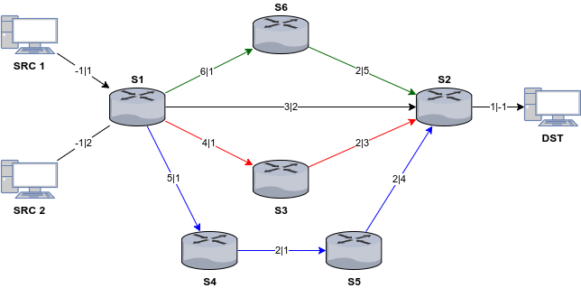
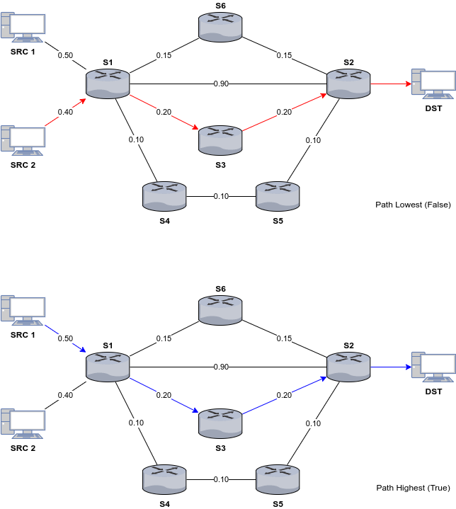
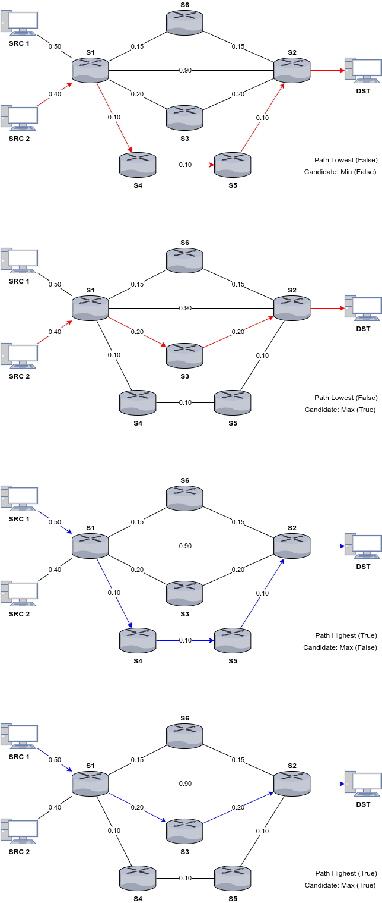
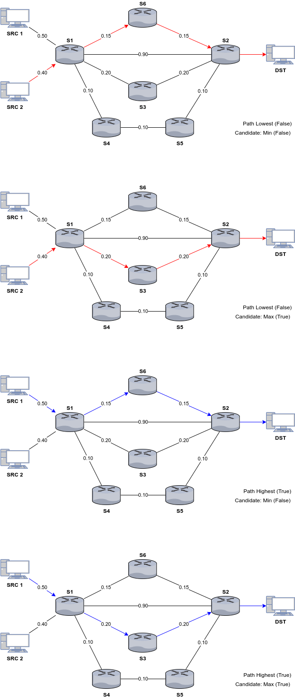
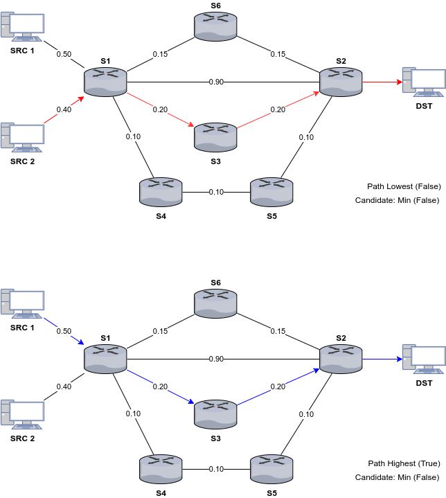

# Experiment - TE Optimisation Method Tests #

This folder contains diagrams which outline the expected results (paths) for
the `code_te_opti_method_test.py` integration test which ensures that the four
Helix TE optimisation algorithms behave correctly. The experiments use the
topology outlined in the `Docs/TEOptiMethodTest/Topo.png` diagram:

The experiment topology is made up of two source hosts (SRC1, SRC2) which will
send traffic to a single destination host (DST). The network contains six
switches (labelled S1-S6). By default, the two source to destination pairs will
use S1-S2 as their primary path.

On the topology diagram, edges are indicated with arrows which are labelled
with the port numbers for each end of the link. For example, the link between
S1 and S6 has a label of '6|1' which indicates that S1 port 6 leads to S6 port
number 1. All links will be assigned a capacity of 1Gbps.

_NOTE: This test will initiate a shallow dummy controller instance which
disables all OpenFlow functionality and callbacks. The test will prime the
controller data-structures with fake information and run the TE optimisation
method directly. To check the results, the integration test will verify the
resulting paths information dictionary._

## Expected Result Diagrams ##

The expected results for the integration test, is outlined in several files
where the name of the file indicates the TE optimisation method being tested.
For example, `Docs/TEOptiMethodTest/CSPFRecomp.png` will test the CSPFRecomp TE
optimisation method.

On the expected result diagrams, the link labels indicate the usage of the link
as a percentage of its capacity (from 0.0 to 1.0). The amount of traffic
sent by each source host is indicated in the diagram by the egress link
connecting the host to S1. A value of 0.50, indicates that a host is sending
500Mbps or 50% of the 1Gbps link's capacity worth of traffic to the destination
host node.

On the result diagrams, the coloured links indicate the expected path changes
to occur after performing the TE optimisation. Expected paths are colour coded,
SRC1 to DST is represented by a blue arrow, SRC2 to DEST by a red arrow. If
a particular arrow colour does not appear in the diagram, this candidate's path
was not modified.

TE optimisation module configuration attributes for each experiment are
indicated in the bottom right hand side corner.

### FirstSol TE optimisation Method ###

### BestSolUsage TE optimisation Method ###

### BestSolPlen TE optimisation Method ###

### CSPFRecomp TE optimisation Method ###

